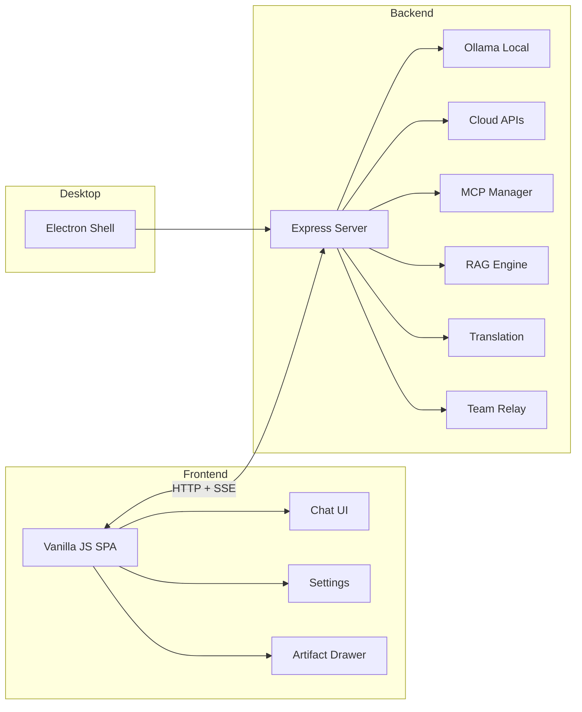

<p align="center">
  
</p>

<h1 align="center">EchoMuse</h1>

<p align="center">
  <strong>Your Private, Local-First AI Desktop Assistant</strong><br>
  Chat · Roleplay · Study Tools · Knowledge Base · MCP Tools — All in One App
</p>

<p align="center">
  <a href="#quick-start--快速开始">Quick Start</a> ·
  <a href="#features--功能亮点">Features</a> ·
  <a href="https://github.com/YPDWHM/EchoMuse/releases">Download</a> ·
  <a href="https://gitee.com/tutuHM/echo-muse/releases">国内下载</a>
</p>

<p align="center">
  
  
  
  
  
  
  
</p>

---

## Why EchoMuse? / 为什么选 EchoMuse？

> **Zero cloud dependency. Your data never leaves your machine.**

Most AI chat apps force you to pick a lane — casual chat, roleplay, or productivity. EchoMuse doesn't. It's a single lightweight desktop app that handles **daily conversations, deep character roleplay, academic study tools, and document-powered knowledge retrieval** — all running locally on your machine with optional cloud API support.

> **零云端依赖，数据始终留在本地。**
>
> 大多数 AI 聊天工具只能做一件事。EchoMuse 不一样 — 日常聊天、深度角色扮演、学习工具、知识库检索，一个桌面应用全部搞定，本地运行，也可接入云端 API。

---

## Features / 功能亮点

### 🤖 Connect Any LLM / 接入任意模型

Run **Ollama models locally** (Qwen3, Mistral, Llama, etc.) or connect to **7+ cloud APIs** (OpenAI, DeepSeek, Kimi, Claude, SiliconFlow, Zhipu, Baichuan) — or mix both. Every model supports **Flash** (fast response) and **Thinking** (deep reasoning with chain-of-thought) dual modes.

本地 Ollama 模型 + 7 种以上云端 API，可混合使用。每个模型支持 Flash（快速）和 Thinking（深度推理）双模式切换。

### 💬 Smart Conversations / 智能对话

- **Multi-session management** with search, favorites, and auto-titling
- **Message branching** — regenerate or edit any message to create tree-structured conversation paths
- **Web search injection** — DuckDuckGo results fed directly into context
- **Real-time translation overlay** — translate AI replies into 8 languages while keeping the original

多会话管理 · 消息分支（树状对话） · 联网搜索注入 · 实时翻译覆盖层（8 语言）

### 🎭 Deep Roleplay System / 深度角色扮演

- **Custom characters** with avatars, expressions, memory text, and relationship settings
- **Tavern card import** — drag-and-drop PNG/JSON character cards
- **Lorebook** — keyword-triggered world-building lore auto-injected into context
- **Multi-character group chat** with spectator mode
- **Message branching** for exploring different story paths

自定义角色卡 · Tavern 卡导入 · Lorebook 世界观书 · 多角色群聊 · 旁观模式 · 剧情分支探索

### 📚 Knowledge Base (RAG) / 知识库检索

Upload documents (txt / md / pdf / docx) → automatic chunking → **BM25 + vector hybrid retrieval**. Toggle it on in any chat and the AI answers with your documents as context.

上传文档自动分块索引，BM25 + 向量混合检索，聊天中一键启用。

### 🔧 MCP Tool Integration / MCP 工具集成

Connect external **MCP servers** (stdio / SSE / HTTP) to extend the AI's capabilities — web scraping, sequential thinking, note-taking, and more. Supports multi-turn automatic tool calling.

接入外部 MCP 服务器，扩展 AI 能力 — 网页抓取、深度推理、笔记等，支持多轮自动工具调用。

### 🎓 Study Tools / 学习工具

- **Exam Review Pack Generator** — outlines, key points, question banks (MCQ / fill-in / short answer), Anki flashcard export
- **Paper & Report Generator** — lab reports, course papers, structured academic writing

期末复习包生成器（大纲 + 题库 + Anki 卡片） · 论文/实验报告生成器

### 🔊 Voice / 语音

- **TTS** — AI reads replies aloud with configurable voice packs
- **STT** — browser speech recognition + local Whisper offline transcription

TTS 语音朗读 + 本地 Whisper 语音输入

### 📤 Export & Share / 导出与共享

- Export to **JSON / Anki CSV / PDF / Word**
- **Team sharing** — OpenAI-compatible API relay with member tokens and usage tracking
- **LAN access** — QR code for mobile/tablet access over local network

多格式导出 · 团队共享（OpenAI 兼容中继） · 局域网 QR 码访问

### 🌍 Polished Experience / 精致体验

- **8 languages** — Chinese, English, Japanese, Korean, French, German, Spanish, Russian
- **3 themes** — Light, Dark, System auto
- **First-run setup wizard** — guided onboarding for beginners
- **PWA support** — also works as a web app in your browser

8 语言 UI · 3 种主题 · 新手引导向导 · PWA 支持

---

## Quick Start / 快速开始

### Option 1: Download Installer (Recommended)

> Go to [GitHub Releases](https://github.com/YPDWHM/EchoMuse/releases) or [Gitee Releases (国内)](https://gitee.com/tutuHM/echo-muse/releases) and grab the latest `.exe` — NSIS installer or portable version.

### Option 2: Run from Source

```bash
git clone https://github.com/YPDWHM/EchoMuse.git
cd EchoMuse
npm install

# Web version (local only)
npm run local

# Desktop version (Electron)
npm run desktop:dev
```

> Gitee 用户：`git clone https://gitee.com/tutuHM/echo-muse.git`

> LAN sharing: `npm run share`

### Option 3: Windows One-Click Bootstrap

```bash
npm run bootstrap:win
```

---

## Model Setup / 模型配置

EchoMuse works with both local and cloud models — use one or both.

### Local Models (Ollama)

Install [Ollama](https://ollama.com), then pull a model:

```bash
ollama pull qwen3:8b      # Recommended — 8B general purpose
ollama pull mistral:7b     # Alternative — fast and lightweight
```

### Cloud APIs

Add a Provider in Settings. Supported:

| Provider | Notes |
|:---|:---|
| OpenAI | GPT series |
| DeepSeek | Cost-effective |
| Kimi (Moonshot) | Long context |
| SiliconFlow | China-optimized CDN |
| Zhipu AI | GLM series |
| Baichuan | Chinese-optimized |
| Anthropic | Claude series |
| Custom | Any OpenAI-compatible endpoint |

---

## Architecture / 架构



---

## Tech Stack / 技术栈

| Layer | Tech |
|:---|:---|
| Frontend | Vanilla JS, KaTeX, Marked |
| Backend | Node.js, Express |
| Desktop | Electron |
| LLM | Ollama, OpenAI API, Anthropic API |
| Retrieval | BM25 + Vector Embedding (Cosine Similarity) |
| Tools | MCP (Model Context Protocol) |
| Export | jsPDF, docx, html2canvas |

---

## Project Structure / 项目结构

```
EchoMuse/
├── server.js              # Express backend (API, LLM, RAG, MCP, translation, team sharing)
├── mcp-manager.js         # MCP client connection manager
├── public/
│   ├── index.html         # Main page
│   ├── app.js             # Frontend logic
│   ├── styles.css         # Styles (light/dark themes)
│   └── js/                # Modular JS (utils, domain, chat render, voice, setup wizard)
├── desktop/
│   ├── main.js            # Electron main process
│   └── preload.js         # Electron preload
├── prompts/               # Prompt templates
└── scripts/               # Startup & build scripts
```

---

## FAQ / 常见问题

**Q: I don't know which model to pick. / 不懂选什么模型？**
Add a cloud API Provider in Settings (e.g. DeepSeek) — no local model needed.
在设置里添加云端 API Provider（如 DeepSeek），不装本地模型也能用。

**Q: Can my PC run local models? / 电脑能跑本地模型吗？**
16GB RAM can handle 8B models (qwen3:8b, mistral:7b). 13B+ needs better hardware.
16GB 内存可跑 8B 级别模型，更大模型需要更好配置。

**Q: How to import character cards? / 怎么导入角色卡？**
Sidebar → Contacts → Import Card. Supports PNG (embedded data) and JSON.
侧边栏「联系人」→「导入卡片」，支持 PNG 和 JSON 格式。

**Q: How to share with others on LAN? / 怎么局域网共享？**
Enable Team Sharing in Settings, generate member tokens, others connect via your LAN IP.
设置里开启「团队共享」，生成成员 Token，对方通过局域网 IP 访问。

---

## Contributing / 参与贡献

Issues and feature requests are welcome on [GitHub](https://github.com/YPDWHM/EchoMuse/issues) or [Gitee](https://gitee.com/tutuHM/echo-muse/issues).

欢迎在 GitHub 或 Gitee 提交 Issue 和功能建议。

---

## License

[EchoMuse Source Available License](LICENSE) — Free for personal, educational, and non-commercial use. Commercial use requires author authorization.

个人使用、学习、教育用途免费。商业用途需获得作者授权。

---

<p align="center">
  If EchoMuse helps you, consider giving it a ⭐ — it means a lot!<br>
  如果 EchoMuse 对你有帮助，点个 ⭐ Star 支持一下吧！
</p>
