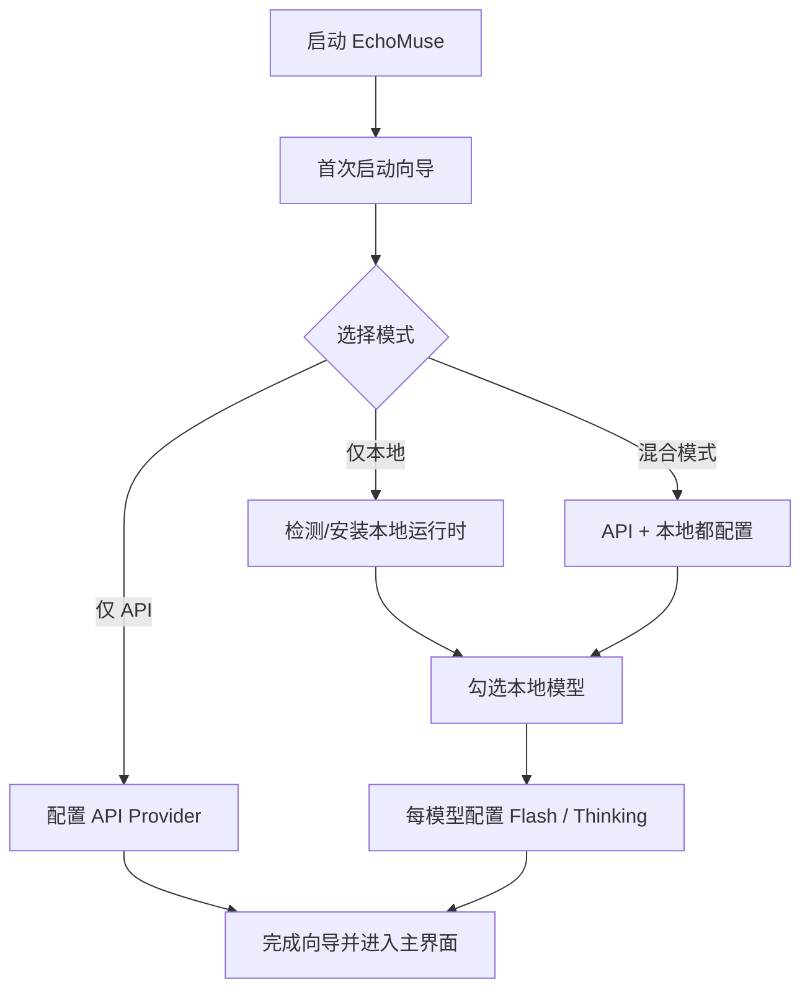

# EchoMuse（桌面版 + 本地/API 混合 AI 助手）


> 一个面向学习 / RP / 日常使用的桌面 AI 应用：支持角色卡、Lorebook（世界观书）、知识库、MCP、翻译覆盖层、语音（TTS/STT）、消息分支等。

## 这份 README 是给谁看的？

- **普通用户**：想下载安装后直接用（推荐看“下载安装与首次启动”）
- **进阶用户**：想用本地模型 / 混合模式（看“模型怎么选”）
- **开发者**：想从源码运行或继续开发（看“开发模式”）

---

## 下载安装与首次启动（目标流程）

> 你之前提的方案已经整理进 `docs/desktop-installer-first-run-spec.md`，后续会按它实现“轻量安装包 + 首启向导按需安装依赖/模型”。

### 推荐分发方式（给别人）

1. **轻量安装包（NSIS）**（推荐）
   - 安装应用本体
   - 首次启动时再询问是否安装本地模型 / 配置 API
2. **便携版（Portable）**（备用）
   - 解压即用
   - 适合临时试用 / 无管理员权限环境

### 首次启动用户会做什么（设计目标）



---

## 模型怎么选（重点：看清“几B”）

### `7B / 8B / 13B / 34B` 是什么意思？

- `B` = 参数规模（十亿级参数）
- 一般规律：
  - **参数越大**：通常效果更强，但更慢、更吃资源
  - **参数越小**：通常更快、更省资源，但能力上限会低一些

### 本地模型选择速查（用户版）

> 实际速度/占用受量化版本（Q4/Q5 等）、CPU/GPU、系统环境影响，下表是“选型参考”。

| 模型 | 规模 | 适合做什么 | 推荐硬件（大致） | 新手建议 |
|---|---:|---|---|---|
| `qwen3:8b` | 8B | 通用聊天 / RP / 学习 | 16GB 内存（CPU可跑）或 6-8GB 显存 | ✅ 推荐先试 |
| `mistral:7b` | 7B | 通用问答 / RP（速度好） | 16GB 内存或 6-8GB 显存 | ✅ 推荐先试 |
| `llama2:7b` | 7B | 基础聊天 | 16GB 内存或 6GB 显存 | ✅ 可选 |
| `llama2:13b` | 13B | 更稳写作/问答 | 24GB+ 内存或 10-12GB 显存 | ⚠ 配置一般别先选 |
| `codellama:7b/13b/34b` | 7B~34B | 编码/代码解释 | 看规模决定硬件 | 👨‍💻 代码场景再选 |
| `vicuna:7b/13b` | 7B~13B | 对话/RP | 中等硬件 | ⚠ 版本差异较大 |
| `yi:6b/9b/34b` | 6B~34B | 中文/双语（视版本） | 看规模决定硬件 | ⚠ 先从小模型开始 |
| `solar:10.7b` | 10.7B | 通用写作/对话 | 16-32GB 内存或 8-12GB 显存 | ✅ 中配可尝试 |
| `mixtral:8x7b` | MoE（重） | 高质量生成 | 高端机器（显存/内存要求高） | ❌ 新手不建议首选 |

### 不知道怎么选？直接按这个选

#### 情况 A：我只想先能用（最快）
- 选 **仅 API**
- 不装本地模型
- 先开始聊天，后面再补本地模型

#### 情况 B：我想离线用，但电脑一般
- 选 **仅本地** 或 **混合模式**
- 只勾一个：`qwen3:8b` 或 `mistral:7b`
- 先不开大模型（13B+、mixtral）

#### 情况 C：我主要做 RP（角色扮演）
- 本地先选 `qwen3:8b` / `mistral:7b`
- 机器好再加更大模型
- 重点是角色/Lorebook/群聊设置，不一定非要一开始上大模型

#### 情况 D：我主要写代码/学编程
- 可加 `codellama`
- 仍建议先从 `7b/13b` 开始

---

## `Flash / Thinking` 到底怎么选？（按模型来，不写死 Qwen）

你之前要求得很对：

- **每个模型单独配置** `Flash / Thinking`
- **不再全局写死** `Qwen Flash / Qwen Thinking`

### 给用户的简单解释（应该在向导里显示）

- `Flash`：更快，适合日常聊天、快速问答
- `Thinking`：更慢，适合复杂推理、长回答、深一点的问题

### 推荐选择方式

- **电脑一般**：先只开 `Flash`
- **机器够强 / 需要复杂推理**：再开 `Thinking`
- **某模型不稳定**：可以只开 `Flash`，关闭 `Thinking`

### UI 显示规则（后续实现）

统一显示成：

- `⚡ 快速模式（当前模型）`
- `🧠 深度模式（当前模型）`

例如：

- `⚡ 快速模式（qwen3:8b）`
- `🧠 深度模式（mistral:7b）`

---

## 功能概览（当前项目方向）

- **角色系统**：角色卡、开场场景、角色画廊
- **Lorebook（世界观书）**：关键词触发型设定注入（RP 核心）
- **知识库**：检索型 RAG（文本/文件、分块、检索）
- **MCP 工具**：本地/远程工具接入与管理
- **翻译覆盖层**：角色原文保留，翻译只做显示层
- **语音**：TTS 朗读 + 本地 Whisper STT（桌面优先）
- **消息分支（Message Tree）**：重新生成/编辑重发形成分支（MVP）
- **群聊增强（MVP）**：角色关系、旁观模式（持续优化中）

---

## 给别人下载时怎么说（简化版话术）

你可以直接发这段给使用者：

1. 下载并安装 `EchoMuse`（推荐安装包）
2. 第一次打开时按向导选择：
   - 不懂模型：选 **仅 API**
   - 想离线：选 **本地模型**，先勾 `qwen3:8b` 或 `mistral:7b`
3. 进入主界面后再慢慢调角色、知识库、语音

---

## 开发模式（源码运行）

### 1) 安装依赖

```bash
npm install
```

### 2) 启动桌面版（开发）

```bash
npm run desktop:dev
```

### 3) 打包桌面版（开发者）

```bash
npm run desktop:build
```

> 注意：当前建议按 `docs/desktop-installer-first-run-spec.md` 调整打包策略，默认不要把大型本地运行时/模型打进安装包。

---

## 本地模型 / 语音相关说明（当前版本）

### 本地 Ollama（可选）

- 如果启用本地模型，需要本地运行时可用（如 Ollama）
- 项目里可能存在 `vendor/ollama/`（开发阶段资源），但**面向普通用户的安装包不应默认塞进去**

### 本地 Whisper 语音输入（可选）

- 本地 STT 依赖 `whisper-cli` + 模型文件
- 这类资源也不应默认打包进轻量安装包
- 更合理做法：首次向导或设置页按需下载/配置

---

## 文档索引

- 安装包 + 首启向导实施规格：`docs/desktop-installer-first-run-spec.md`
- 开发记录（短日志）：`DEVLOG.md`
- 阶段总结：`notes/`

---

## 常见问题（简短版）

### 1) 我看不懂模型，怕选错
直接选 **仅 API**，先用起来；后面再加本地模型。

### 2) 我电脑一般，但想本地跑
先选一个 `7B/8B` 模型：`qwen3:8b` 或 `mistral:7b`。

### 3) 为什么不要把本地模型直接打进安装包？
因为会让安装包巨大、构建容易失败，也不符合“按用户选择安装”的流程。
