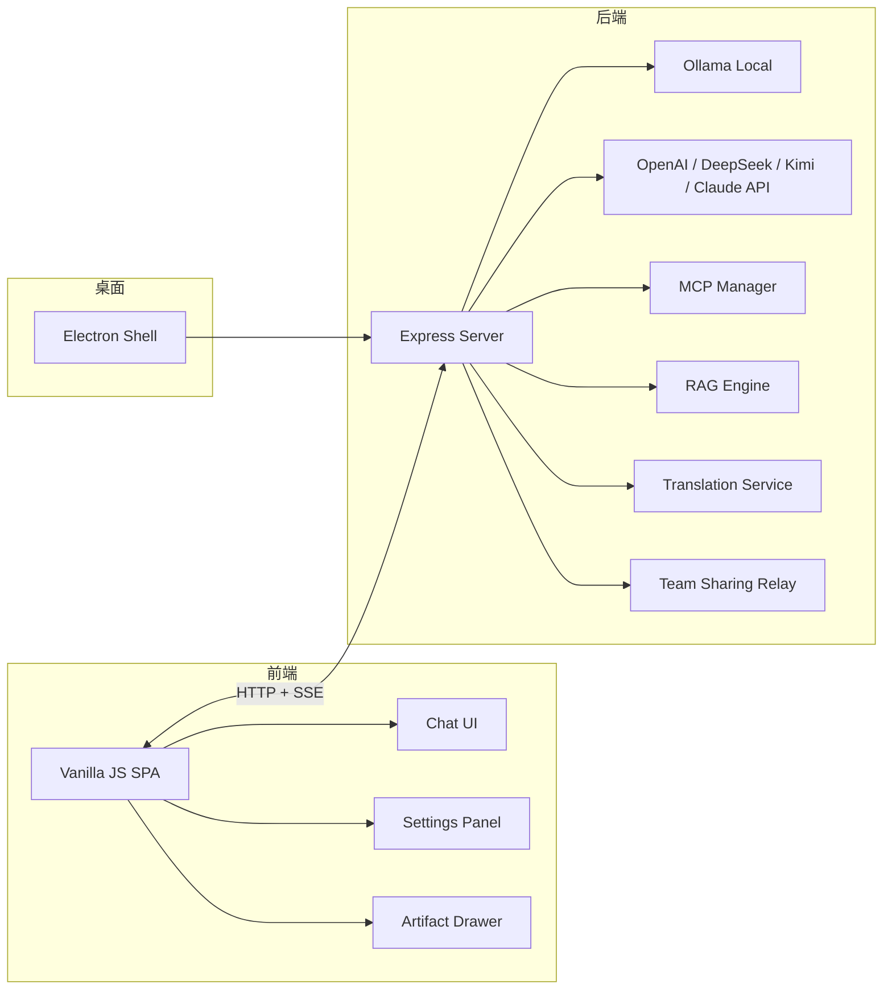

<p align="center">
  
</p>

<h1 align="center">EchoMuse</h1>

<p align="center">
  零云端、本地优先的桌面 AI 助手 — 聊天 · 角色扮演 · 学习工具 · 知识库，一个应用全搞定
</p>

<p align="center">
  
  
  
  
  
  
</p>

---

## 它能做什么？

EchoMuse 把**日常聊天、角色扮演（RP）、学习工具、知识库检索**融合在一个轻量桌面应用里，同时支持本地模型和云端 API。

### 核心功能一览

| 功能 | 说明 |
|:---|:---|
| 💬 **多会话聊天** | 多会话管理、收藏、搜索，支持 Flash / Thinking 双模式切换 |
| 🤖 **多模型后端** | Ollama 本地模型 + OpenAI / DeepSeek / Kimi / Claude 等 7+ 云端 API |
| 🎭 **角色系统** | 自定义角色卡、Tavern 卡导入、表情/头像、记忆文本、关系设定 |
| 📖 **Lorebook 世界观书** | 关键词触发型设定注入，RP 深度玩家的刚需 |
| 👥 **群聊** | 多角色群组对话、旁观模式、角色间互动 |
| 🌳 **消息分支** | 任意消息节点重新生成 / 编辑重发，形成树状对话分支 |
| 📚 **知识库 RAG** | 上传文档（txt/md/pdf/docx）→ 分块 → BM25 + 向量混合检索 |
| 🔧 **MCP 工具** | 接入外部 MCP 服务器（时间、网页抓取、笔记、思维链等） |
| 🌐 **翻译覆盖层** | 实时翻译 AI 回复，支持 8 种语言，原文保留 |
| 🔊 **语音 TTS / STT** | TTS 朗读回复 + 本地 Whisper 语音输入 |
| 🔍 **联网搜索** | DuckDuckGo 搜索结果注入对话上下文 |
| 🎓 **学习工具** | 期末复习包生成器 + 论文/实验报告生成器 |
| 📤 **多格式导出** | JSON / Anki CSV / PDF / Word 导出 |
| 👨‍👩‍👧‍👦 **团队共享** | OpenAI 兼容 API 中继，多成员 Token 管理与用量统计 |
| 🌍 **国际化** | 中/英/日/韩/法/德/西/俄 8 语言完整 UI |
| 📱 **局域网访问** | QR 码分享，手机/平板直接用 |

---

## 架构概览



---

## 快速开始

### 方式一：桌面安装包（推荐普通用户）

> 前往 [Releases](https://github.com/YPDWHM/EchoMuse/releases) 下载最新安装包（NSIS 安装版或 Portable 便携版）。

### 方式二：从源码运行（开发者）

```bash
# 1. 克隆仓库
git clone https://github.com/YPDWHM/EchoMuse.git
cd EchoMuse

# 2. 安装依赖
npm install

# 3. 启动 Web 版（仅本地访问）
npm run local

# 4. 或启动桌面版（Electron）
npm run desktop:dev
```

> 如果需要局域网共享访问：`npm run share`

### 方式三：一键引导（Windows）

```bash
npm run bootstrap:win
```

---

## 模型配置

EchoMuse 支持**本地模型**和**云端 API** 混合使用，你可以随时在设置面板切换。

### 本地模型（Ollama）

安装 [Ollama](https://ollama.com) 后拉取模型即可：

```bash
ollama pull qwen3:8b    # 推荐首选，8B 通用模型
ollama pull mistral:7b   # 备选，速度快
```

### 云端 API

在设置面板添加 Provider，支持：

| Provider | 说明 |
|:---|:---|
| OpenAI | GPT 系列 |
| DeepSeek | 性价比高 |
| Kimi (Moonshot) | 长上下文 |
| SiliconFlow | 国内加速 |
| Zhipu AI (智谱) | GLM 系列 |
| Baichuan (百川) | 中文优化 |
| Anthropic | Claude 系列 |
| 自定义 | 任意 OpenAI 兼容端点 |

### Flash vs Thinking 模式

- **Flash（快速模式）**：低温度、快响应，适合日常聊天
- **Thinking（深度模式）**：高 token 上限、支持思维链，适合复杂推理

每个模型可独立配置这两种模式。

---

## 功能详解

### 🎭 角色扮演系统

- 创建自定义角色：名称、关系、自定义 prompt、表情/图片头像
- 导入 Tavern 角色卡（PNG 内嵌 `chara` 数据 或 JSON 格式）
- 记忆文本导入：粘贴或上传 `.txt` / `.md` / `.json`，让 AI 模仿特定人格
- 角色绑定到会话，不同会话可以用不同角色

### 📖 Lorebook 世界观书

- 定义关键词触发的世界观条目
- 对话中提到关键词时自动注入背景设定
- 适合构建复杂的 RP 世界观（魔法体系、组织架构、地理设定等）

### 👥 群聊

- 创建多角色群组，AI 扮演多个角色轮流发言
- 设定角色间关系影响对话风格
- 旁观模式：用户可以观看 AI 角色之间的互动

### 🌳 消息分支（Message Tree）

- 在任意消息节点重新生成或编辑后重发
- 形成树状对话结构，左右箭头切换分支
- 适合探索不同思路、尝试不同剧情走向

### 📚 知识库 RAG

- 上传文档（txt / md / pdf / docx）自动分块索引
- BM25 词法检索 + 向量语义检索混合排序
- 可配置：分块大小、重叠、Top-K、最低分数
- 在聊天中一键启用，AI 回答自动引用知识库内容

### 🔧 MCP 工具集成

- 连接外部 MCP 服务器（stdio / SSE / HTTP）
- 内置预设：时间日历、网页抓取、笔记记忆、思维链
- 支持自定义 MCP 服务器配置和剪贴板 JSON 导入
- 对话中自动多轮工具调用（最多 5 轮）

### 🎓 学习工具

- **期末复习包生成器**：章节大纲 + 重点 + 题库（选择/填空/简答/综合）+ Anki 卡片
- **论文报告生成器**：实验报告 / 课程报告 / 学术论文，含方法/结果/讨论结构

---

## 打包发布

```bash
# NSIS 安装包
npm run desktop:build:nsis

# 便携版
npm run desktop:build:portable

# 两者都构建
npm run desktop:build
```

输出目录：`desktop-dist/`

---

## 项目结构

```
EchoMuse/
├── server.js              # Express 后端（API、LLM、RAG、MCP、翻译、团队共享）
├── mcp-manager.js         # MCP 客户端连接管理
├── public/
│   ├── index.html         # 主页面
│   ├── app.js             # 前端主逻辑
│   ├── styles.css         # 样式（亮/暗主题）
│   └── js/
│       ├── utils-core.js  # 通用工具函数
│       ├── domain-core.js # 领域逻辑（会话、角色、Tavern 解析）
│       └── chat-render-core.js  # 聊天渲染
├── desktop/
│   ├── main.js            # Electron 主进程
│   └── preload.js         # Electron 预加载脚本
├── prompts/               # Prompt 模板
├── scripts/               # 启动 & 引导脚本
└── docs/                  # 设计文档
```

---

## 常见问题

**Q: 不懂模型怎么选？**
直接在设置里添加一个云端 API Provider（如 DeepSeek），不装本地模型也能用。

**Q: 电脑配置一般，能跑本地模型吗？**
16GB 内存可以跑 `qwen3:8b` 或 `mistral:7b`（8B 级别）。更大的模型（13B+）需要更好的硬件。

**Q: Tavern 角色卡怎么导入？**
侧边栏「联系人」→「导入酒馆卡片」，支持 PNG（内嵌数据）和 JSON 格式。

**Q: 怎么让别人也能用我的服务？**
设置里开启「团队共享」，生成成员 Token，对方通过局域网 IP 访问即可。

---

## 技术栈

| 层 | 技术 |
|:---|:---|
| 前端 | Vanilla JS、KaTeX、Marked |
| 后端 | Node.js、Express |
| 桌面 | Electron |
| LLM | Ollama、OpenAI API、Anthropic API |
| 检索 | BM25 + 向量嵌入（余弦相似度） |
| 工具 | MCP (Model Context Protocol) |
| 导出 | jsPDF、docx、html2canvas |

---

## License

MIT


